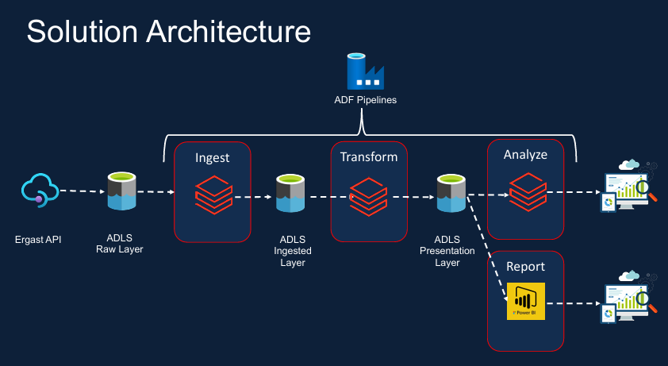

# Formula1_Azure_Project

---
## Azure Data Project Overview  
This project ingests, transforms, and analyzes Formula 1 racing data from the **Ergast API** to generate actionable insights and reports. The solution leverages **Azure Data Factory (ADF)** for orchestration and **Azure Data Lake Storage (ADLS)** for scalable data storage across multiple layers. The workflow is divided into three stages: **Ingest**, **Transform**, and **Analyze**, with data progressing through raw, ingested, and presentation layers for structured reporting.

---

## Project Requirements

### 1. Data Ingestion Requirements  
- Ingest all **8 files** into the data lake.  
- Ingested data must:  
  - Have the schema applied.  
  - Include audit columns (`load_timestamp`, `source_file_name`).  
  - Be stored in **columnar format (Parquet)**.  
  - Be queryable via **SQL** for analysis.  
- Ingestion logic must support **incremental loads** (e.g., only new/updated data).  

### 2. Data Transformation Requirements  
- Create new tables by joining key information for:  
  - **Reporting** (e.g., aggregated standings).  
  - **Analysis** (e.g., performance trends).  
- Transformed tables must:  
  - Include audit columns (e.g., `transformation_timestamp`).  
  - Be stored in **columnar format (Parquet)**.  
  - Be queryable via **SQL** for analysis.  
- Transformation logic must support **incremental loads**.  

### 3. Reporting Requirements  
- Generate the following reports:  
  - **Driver Standings** (rankings by points, wins, etc.).  
  - **Constructor Standings** (team rankings).  

### 4. Analysis Requirements  
- Perform analysis on:  
  - **Dominant Drivers** ( win rate, consistency).  
  - **Dominant Teams** (constructor performance over seasons).  
- **Visualize outputs** using charts/graphs.  
- Create **Databricks Dashboards** for interactive exploration.  

### 5. Scheduling Requirements  
- Schedule pipelines to run **every Sunday at 10 PM**.  
- Enable:  
  - Pipeline monitoring (success/failure logs).  
  - Re-running failed pipelines manually or automatically.  
  - Alerting (email/SMS notifications on failures).  

---

## Solution Architecture Breakdown

### 1. Data Ingestion  
- **Source**: Data is extracted from the **Ergast API**, which provides historical and real-time Formula 1 racing data (e.g., race results, driver standings, circuit details).  
- **ADF Pipeline**: Azure Data Factory orchestrates the ingestion process, pulling raw data (JSON/XML) from the API and landing it into the **ADLS Raw Layer**.  
  - **Raw Layer**: Stores unstructured/semi-structured data in its original format for auditing and reprocessing.  

### 2. Data Transformation  
- **ADF Pipeline**: Transforms raw data into a structured format using mapping, filtering, and aggregation.  
  - **Ingested Layer**: Stores cleansed, validated, and schema-enforced data (e.g., Parquet files) for downstream processing.  
  - Example transformations:  
    - Flatten nested JSON structures.  
    - Convert timestamps to UTC.  
    - Enrich data with calculated fields (e.g., lap time averages).  

### 3. Data Analysis & Reporting  
- **ADF Pipeline**: Prepares data for analytics by aggregating tables and joining datasets (e.g., merging driver and race data).  
  - **Presentation Layer**: Hosts curated, business-ready datasets optimized for querying (e.g., star schema tables).  
- **Report**: Final insights are visualized in tools like **Power BI**, showing metrics such as:  
  - Driver/team performance trends.  
  - Historical race statistics.  
  - Season standings.  

---

## Key Components  
- **Azure Data Factory (ADF)**:  
  - Orchestrates end-to-end pipelines (`ingest → transform → analyze`).  
  - Implements error handling, retries, and monitoring.  
- **Azure Data Lake Storage (ADLS)**:  
  - **Raw Layer**: Retains raw API data.  
  - **Ingested Layer**: Stores processed, structured data.  
  - **Presentation Layer**: Houses analytics-ready datasets.  
- **Ergast API**: Primary data source for Formula 1 racing data.  

---

## Benefits  
1. **Scalability**: ADLS and ADF handle large volumes of historical and real-time racing data.  
2. **Data Governance**: Separation of raw, ingested, and presentation layers ensures traceability and compliance.  
3. **Actionable Insights**: Enables data-driven decisions for teams, sponsors, or analysts.  
